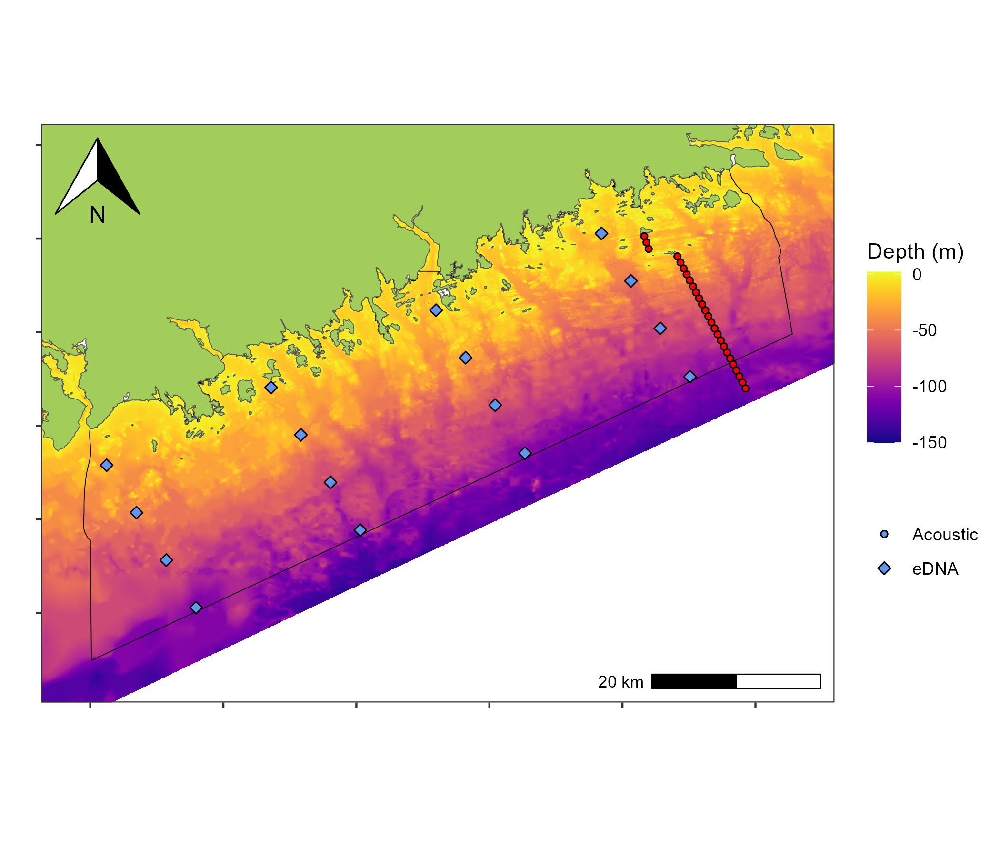
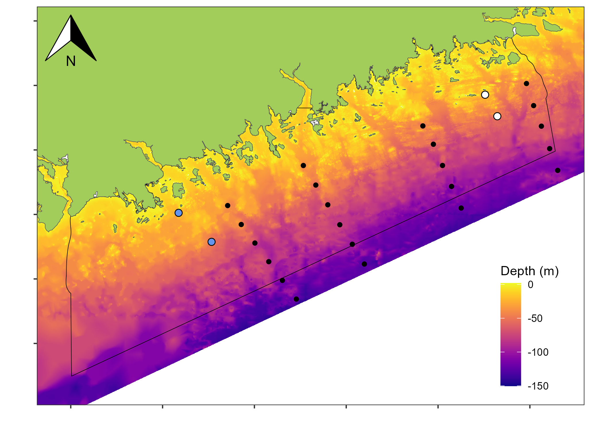
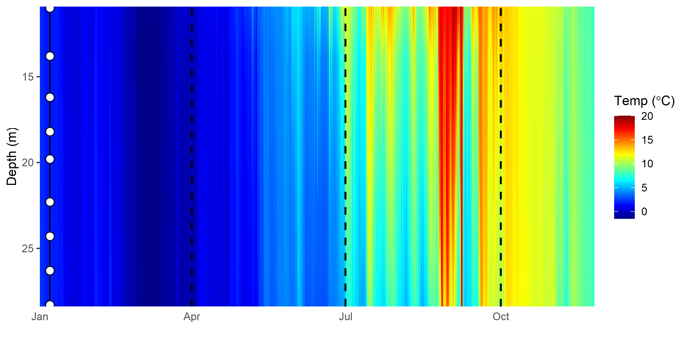

# easternshoreislands_aoi
Eastern Shore Islands Area of Interest

__Fig 1.__ Eastern Shore Islands Area of Interest depicting locations of the 2023 reciever array and eDNA sample locations. 

__Fig 2.__ Deployment locations of Acoustic Dopler Current Profiler (ADCP) moorings (2018-2019) at Ship Harbour and Moser River (blue and white, respectively) at for deep and shallow locations (~ 25m and 50 m, respectively).

__Fig 3.__ Temperature profile for Ship Harbour Shallow. Temperature values were interpolated sequentially among temperature loggers deployed along a mooring line (white dots). Vertical dashed lines denote the onset of different 'seasons'.  